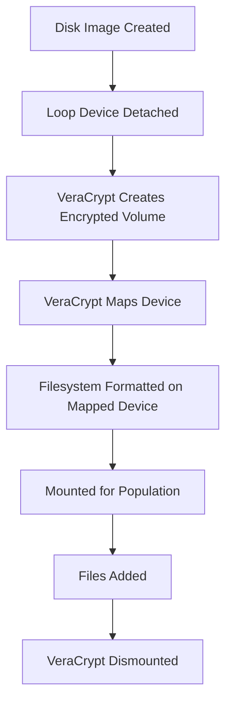

# Encryption

DiskForge supports two encryption methods: **LUKS** for partition-level encryption and **VeraCrypt** for full-disk encryption.

---

## Comparison

| Feature | LUKS | VeraCrypt |
|---------|------|-----------|
| **Scope** | Single partition | Full disk |
| **Versions** | v1, v2 | AES + SHA-512 |
| **Supported Filesystems** | ext2, ext3, ext4, xfs | ext2, ext3, ext4, xfs, ntfs, fat32 |
| **Manifest Location** | `partition.encrypt` | `disk.encrypt` |
| **Forensic Detection** | `cryptsetup isLuks` | VeraCrypt header analysis |
| **Decryption Tool** | `cryptsetup open` | `veracrypt --mount` |

---

## LUKS Encryption

LUKS (Linux Unified Key Setup) encrypts individual partitions. Add the `encrypt` block to any partition definition.

### Configuration

```json
{
  "number": 1,
  "type": "primary",
  "filesystem": "ext4",
  "label": "ENCRYPTED",
  "size": "500M",
  "encrypt": {
    "type": "luks",
    "version": "1",
    "passphrase": "secret123"
  },
  "populate": {
    "add_files": [{ "source": "/files/*", "target": "/" }]
  }
}
```

### Options

| Field | Values | Default | Description |
|-------|--------|---------|-------------|
| `type` | `"luks"` | — | Required |
| `version` | `"1"`, `"2"` | `"1"` | LUKS format version |
| `passphrase` | string | — | Required. Decryption passphrase |

### Restrictions

!!! warning "Filesystem Restrictions"
    LUKS encryption only supports **ext2, ext3, ext4, and xfs** filesystems. FAT32, NTFS, and exFAT are not supported with LUKS.

- Cannot be applied to extended partitions (apply to logical partitions instead)
- Each encrypted partition has its own passphrase

### LUKS v1 vs v2

=== "LUKS v1"

    - Broader compatibility with older forensic tools
    - Uses PBKDF2 key derivation
    - Good default for training scenarios

=== "LUKS v2"

    - Uses Argon2id key derivation (more resistant to brute force)
    - Supports authenticated encryption
    - Better for modern forensics training

### Decrypting for Analysis

```bash
# Detect LUKS header
cryptsetup isLuks /dev/sda1

# Decrypt and map
cryptsetup open /dev/sda1 evidence_decrypted
# Enter passphrase when prompted

# Mount the decrypted volume
mount /dev/mapper/evidence_decrypted /mnt/evidence

# When finished
umount /mnt/evidence
cryptsetup close evidence_decrypted
```

---

## VeraCrypt Encryption

VeraCrypt provides full-disk encryption. The `encrypt` block is placed at the **disk level**, not on individual partitions.

### Configuration

```json
{
  "name": "encrypted-disk",
  "type": "GPT",
  "size": "512M",
  "encrypt": {
    "type": "veracrypt",
    "passphrase": "secret123"
  },
  "partitions": [
    {
      "number": 1,
      "type": "primary",
      "filesystem": "ext4",
      "label": "VERA_DATA",
      "size": "500M",
      "populate": {
        "add_files": [{ "source": "/files/*", "target": "/" }]
      }
    }
  ]
}
```

### Options

| Field | Values | Default | Description |
|-------|--------|---------|-------------|
| `type` | `"veracrypt"` | — | Required |
| `passphrase` | string | — | Required. Decryption passphrase |

### How It Works



### Restrictions

!!! note
    - VeraCrypt encryption is **full-disk only** — it cannot be applied to individual partitions
    - Only **one partition** is supported inside a VeraCrypt-encrypted disk
    - The encryption uses AES with SHA-512

### Decrypting for Analysis

```bash
# Mount with VeraCrypt CLI
veracrypt --text --mount disk.img /mnt/evidence \
  --password "secret123" --pim 0 --keyfiles "" --non-interactive

# Browse the decrypted contents
ls /mnt/evidence

# Dismount
veracrypt --text --dismount disk.img
```

---

## Training Scenarios

### Scenario: Hidden Encrypted Partition

A disk with an unencrypted FAT32 partition and a LUKS-encrypted partition containing sensitive data:

```json
{
  "disks": [{
    "name": "suspect-drive",
    "type": "GPT",
    "size": "1G",
    "partitions": [
      {
        "number": 1,
        "type": "primary",
        "filesystem": "fat32",
        "label": "PUBLIC",
        "size": "500M",
        "populate": {
          "add_files": [{ "source": "/files/public/*", "target": "/" }]
        }
      },
      {
        "number": 2,
        "type": "primary",
        "filesystem": "ext4",
        "label": "HIDDEN",
        "size": "400M",
        "encrypt": {
          "type": "luks",
          "passphrase": "evidence2024"
        },
        "populate": {
          "add_files": [{ "source": "/files/sensitive/*", "target": "/" }]
        }
      }
    ]
  }]
}
```

Students must:

1. Identify the partition layout with `mmls`
2. Detect the LUKS header with `cryptsetup isLuks`
3. Decrypt with a recovered/cracked passphrase
4. Analyze the encrypted contents
