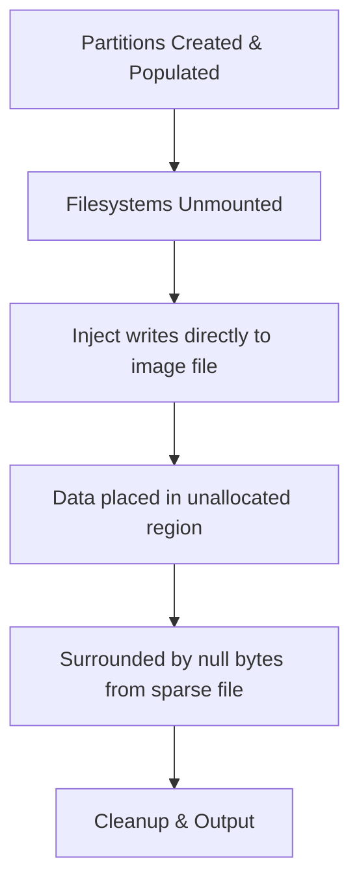

# Unallocated Space Injection

Inject hidden data into unallocated disk space — the region after the last partition boundary. This simulates forensic artifacts like:

- Remnants from a previous filesystem format
- Anti-forensic data hiding techniques
- BitLocker recovery keys or passwords left in slack space
- Deleted partition remnants

The injected data is invisible to the filesystem but discoverable with raw disk analysis tools like `strings`, `blkls`, or hex editors.

---

## How It Works



DiskForge creates disk images using `truncate`, which produces a sparse file filled with zeros. After all partitions are populated and unmounted, the injector writes data directly to the raw image file at calculated byte offsets in the unallocated region. The result: hidden data surrounded by null bytes, exactly like remnants from a formatted disk.

---

## Configuration

Add an `inject` array at the disk level:

```json
{
  "name": "suspect-drive",
  "type": "MBR",
  "size": "512M",
  "bootable": true,
  "partitions": [
    {
      "number": 1,
      "type": "primary",
      "filesystem": "ntfs",
      "label": "SYSTEM",
      "size": "400M",
      "populate": {
        "add_files": [{ "source": "/files/*", "target": "/" }]
      }
    }
  ],
  "inject": [
    {
      "location": "unallocated",
      "data": "BitLocker Recovery Key: 274180-183710-572174-291048-174017-048175-339281-172649",
      "offset": 4096
    },
    {
      "location": "unallocated",
      "data": "password: Tr4ining!S3cret#2025",
      "offset": 16384
    }
  ]
}
```

### Fields

| Field | Type | Required | Description |
|-------|------|----------|-------------|
| `location` | string | Yes | `"unallocated"` — after the last partition boundary |
| `data` | string | One of data/source | Inline text to inject (UTF-8 encoded) |
| `source` | string | One of data/source | Path to a binary file to inject |
| `offset` | integer | No | Byte offset from the start of the unallocated region (default: 0) |

!!! note
    Each inject entry must have either `data` (inline text) or `source` (file path), not both. Use `offset` to place multiple injections at different positions within the unallocated space.

---

## Data Sources

### Inline text

For passwords, recovery keys, and short messages:

```json
{
  "location": "unallocated",
  "data": "BitLocker Recovery Key: 274180-183710-572174-291048",
  "offset": 4096
}
```

### File source

For binary data, larger payloads, or pre-crafted artifacts:

```json
{
  "location": "unallocated",
  "source": "/files/hidden_message.bin",
  "offset": 8192
}
```

---

## Where the Data Goes

The unallocated region starts immediately after the last partition ends:

```
|  MBR  | Partition 1 (NTFS) | Partition 2 (ext4) |  Unallocated Space  |
|       |                    |                    | ↑ inject goes here  |
0     512                                         ^-- calculated offset
```

DiskForge calculates the exact byte offset automatically based on your partition layout. The `offset` field in each inject entry is relative to the start of the unallocated region, not the start of the disk.

---

## Forensic Analysis

### Finding injected data

Students can discover the hidden data using:

```bash
# Search for readable strings in the entire image
strings training_inject.img | grep -i "recovery key"
strings training_inject.img | grep -i "password"

# Use Sleuth Kit to extract unallocated space
blkls training_inject.img > unallocated.bin
strings unallocated.bin

# Hex editor at the unallocated region
mmls training_inject.img
# Note the unallocated gap, then:
xxd -s <offset> -l 512 training_inject.img
```

### Verifying data is NOT in the filesystem

```bash
# Mount the partition — hidden data should not appear
losetup --find --show training_inject.img
kpartx -a /dev/loop0
mount /dev/mapper/loop0p1 /mnt/evidence
grep -r "Recovery Key" /mnt/evidence  # Should find nothing
```

---

## Restrictions

- Only works on **MBR** and **GPT** disks (not RAW — no partition table means no unallocated space concept)
- Data must fit within the unallocated region (DiskForge validates this)
- The disk must have unallocated space (partition sizes must not fill the entire disk)

---

## Training Scenarios

### Scenario: BitLocker Key Recovery

An employee's laptop was seized. The main partition is BitLocker-encrypted, but during a previous OS reinstall, the recovery key was written to disk and never properly wiped:

```json
{
  "inject": [
    {
      "location": "unallocated",
      "data": "BitLocker Recovery Key: 274180-183710-572174-291048-174017-048175-339281-172649",
      "offset": 4096
    }
  ]
}
```

Students must: analyze the raw disk with `strings` or `blkls`, find the recovery key in unallocated space, and use it to decrypt the BitLocker volume.

### Scenario: Anti-Forensic Data Hiding

A suspect has hidden credentials in unallocated space as a dead drop:

```json
{
  "inject": [
    {
      "location": "unallocated",
      "data": "ssh root@192.168.1.50 -p 2222\npassword: darkweb_access_2025",
      "offset": 32768
    }
  ]
}
```

Students must: examine the full disk image beyond the filesystem, identify the hidden connection details, and document the finding.
