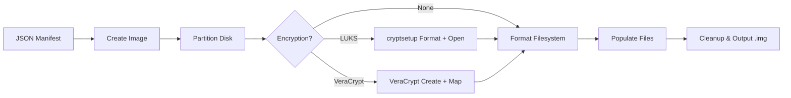

# DiskForge

**Build forensics-ready disk images from JSON manifests.**

DiskForge is a Python-based tool for generating partitioned and encrypted disk images for digital forensics training, incident response simulations, CTF challenges, and lab environments. Define your disk layout in a JSON manifest, run a single Docker command, and get a ready-to-analyze `.img` file.

---

<div class="grid cards" markdown>

-   :material-rocket-launch: **Getting Started**

    ---

    Install prerequisites and build your first disk image in minutes.

    [:octicons-arrow-right-24: Quick Start](getting-started/quick-start.md)

-   :material-file-document-edit: **Configuration**

    ---

    Complete manifest reference for disks, partitions, filesystems, and encryption.

    [:octicons-arrow-right-24: Manifest Reference](configuration/manifest-reference.md)

-   :material-lock: **Encryption**

    ---

    LUKS partition-level and VeraCrypt full-disk encryption support.

    [:octicons-arrow-right-24: Encryption Guide](configuration/encryption.md)

-   :material-test-tube: **Examples**

    ---

    Real-world example manifests for GPT, MBR, LUKS, and VeraCrypt scenarios.

    [:octicons-arrow-right-24: Examples](examples/basic-gpt.md)

-   :material-magnify: **Analysis**

    ---

    Analyze your built images with Sleuth Kit, hex editors, and forensic tools.

    [:octicons-arrow-right-24: Analyzing Images](analysis/analyzing-images.md)

-   :material-wrench: **Troubleshooting**

    ---

    Common issues with Docker, encryption, and filesystem operations.

    [:octicons-arrow-right-24: Troubleshooting](reference/troubleshooting.md)

</div>

---

## How It Works



---

## Features

| Feature | Details |
|---------|---------|
| **Partition Tables** | MBR (primary, extended, logical) and GPT |
| **Filesystems** | FAT32, NTFS, ext2/3/4, XFS, exFAT |
| **Encryption** | LUKS v1/v2 (partition-level), VeraCrypt (full-disk) |
| **File Operations** | Add, copy, move, delete with glob/wildcard support |
| **Multi-Disk** | Build multiple disk images from a single manifest |
| **Testing** | Automated build + verification suite with passphrase validation |
| **Deployment** | Dockerized, reproducible, runs on amd64 and arm64 |

---

## Quick Example

```bash
docker build -t diskforge .
docker run --rm --privileged \
  -v "$(pwd)/manifest.json:/manifests/manifest.json" \
  -v "$(pwd)/files:/files" \
  -v "$(pwd)/output:/output" \
  diskforge /manifests/manifest.json
```

---

## License

MIT License. See [LICENSE](https://github.com/jknyght9/diskforge) for details.

**Created by Jacob Stauffer** | CISSP, GCFA, GREM, OSCP
